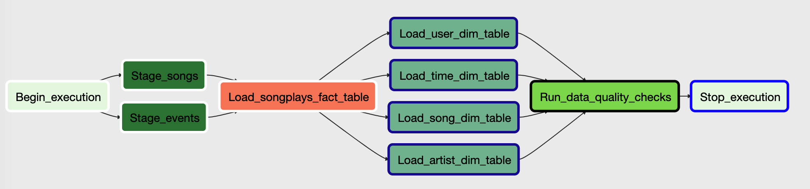

# Purpose

Sparkify, an online music streaming company, has decided to introduce an auto data warehouse ETL pipeline with some monitoring. The original data lies in S3 and is in format of JSON. There are two parts of data: the song metadata and the users' log events. 

# Pipeline Design

We choose Apache Airflow as the pipeline engine for this project. The data lies in Amazon S3, we have to construct a pipeline DAG first loading the data from S3 into Redshift as staging tables, and construct the fact table and then dimension tables, finally run some quality checks to ensure the final data is correct.

# Steps

## Redshift Cluster Startup

Sign in to the AWS Management console and open the Amazon Redshift console. Click **Launch cluster**.

In cluster details page, enter the following values:

* Cluster identifier: `redshift-cluster`
* Database name: `dev`
* Database port: `5439`
* Master user name: `awsuser`
* Master user password: A password with upper and lower case letters and numbers
* Confirm password: The same as master user password

On the node configuration page choose `dc2.large` with 4 nodes. On the additional configuration page enter the following:

* VPC security groups: `redshift_security_group`
* Available IAM Roles: `myRedshiftRole`

On the review page, click **Launch cluster**. Wait for the cluster to be ready.

## Create Tables

When cluster is ready, go to the query editor page, using the SQL statements in `airflow/create_tables.sql` to create all the tables needed, including:

* staging_events
* staging_songs
* songplays
* time
* users
* artists
* songs

## Configure Connections

In airflow web page, click **Admin** --> **Connections**. In **Create** panel, first create `aws_credentials`:

* Conn Id: `aws_credentials`
* Conn Type: `Amazon Web Services`
* Login: Access key of `airflow_redshift_user`
* Password: Secret key of `airflow_redshift_user`

Then create `redshift`:

* Conn Id: `redshift`
* Conn Type: `Postgres`
* Host: The URL on Redshift cluster page
* Schema: `dev`
* Login: `awsuser`
* Password: Password of `awsuser`
* Port: `5439`

## Activate DAG

In airflow web page, click **DAGs**, switch on udac_example_dag, and run the DAG.