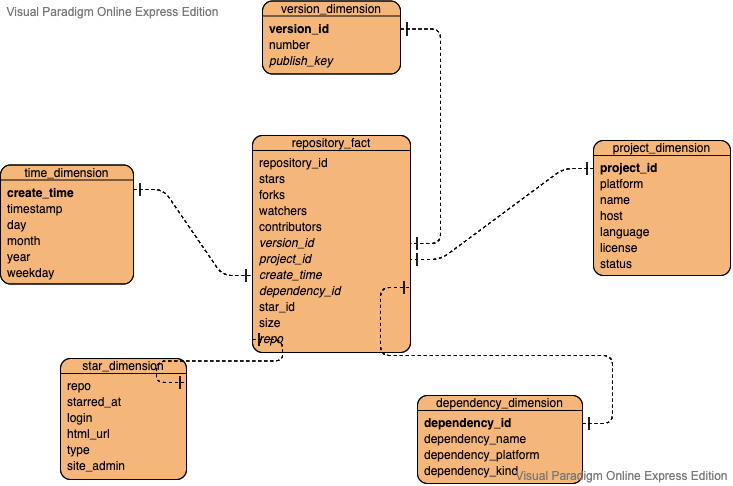
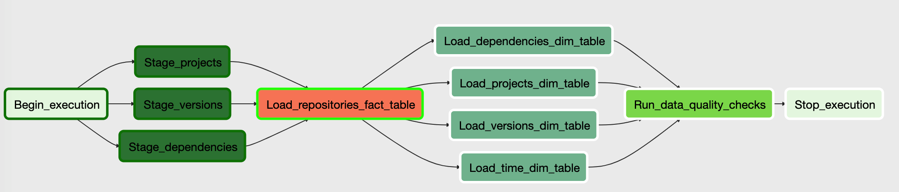

# A Free World in Github

# Project Scope

This capstone project focuses on the open source software hosted in Github. It will do some interesting analysis about the data of them. I will first collect related datasets, extract some samples and do some EDAs locally in order to understand the data and find some insights. Second, I will upload the datasets into AWS S3 bucket, using Apache Airflow to create a pipeline using Spark on EMR to load them into staging tables on redshift and perform ETLs forming a series of target tables. 

The end case of this project will be a data visualization dashboard showing the results, with the help of some front-end and backend techniques.

# Gather Data

I find the public dataset from [awesome public datasets](https://github.com/awesomedata/awesome-public-datasets) in the portion of **Software**. The datasets are of 13GB and in CSV format and come from [Libraries.io Open Source Repository and Dependency Metadata](https://zenodo.org/record/1068916). This data is collected from GitLab, Github and BitBucket. 

# Explore & Assess Data

I downloaded the file `Libraries.io-open-data-1.0.0.zip`, unzip it and upload open source software data onto S3 at `s3://dend-capstone-lkj`. These data includes information about projects, repositories, versions and dependencies. Before all the pipeline work, I first lauch an EMR cluster and assess and analyse data using Jupyter Notebook combining with Spark. Please refer [CapstoneEDA.ipynb](https://github.com/leesper/become-data-engineer/blob/master/P4_CapstoneProject/CapstoneEDA.ipynb) for detailed information.

# Conceptual Data Model

I designed a star model for the data:

We have the repositories centered as the fact table, then there are at least four dimensions: version, project, time and dependency. In the repository fact table we have the facts about the open source repository: its stars, forks, contributors, size and so on. And we can query information about project, version, time and dependency relationship on dimension tables.

# ETL Data Modeling

I designed the pipeline model as three parts: staging part, fact-and-dimension part and checking part. At first we have to load all the data from S3 into three staging tables: `staging_projects`, `staging_versions` and `staging_dependencies`; then load data from staging table into fact and dimension tables, constructing tables: `repository_fact`, `dependency_dim`, `project_dim`, `version_dim` and `time_dim`; at last we checked and assured the tables.

# Dictionary

## Table `repository_fact`
| field         | meaning |
| ------------- | ------------ |
| repository_id | unique primary key |
| stars         | number of stars |
| forks         | number of forks |
| watchers      | number of watchers |
| contributors  | number of contributors |
| size          | size in kilobytes |
| repo          | repository name with owner |
| version_id    | unique id of version |
| project_id    | unique id of project |
| create_time   | timestamp of when repository is created |
| dependency_id | unique if of dependency |

## Table `version_dim`
| field         | meaning |
| ------------- | ------------ |
| version_id    | unique primary key |
| number        | number of release  |
| publish_time  | timestamp when version is published |

## Table `project_dim`
| field         | meaning |
| ------------- | ------------ |
| project_id    | unique primary key |
| platform      | name of the package manager |
| name          | name of the project |
| host          | repository host type |
| language      | programming language |
| license       | license information  |
| status        | status of the project |

## Table `dependency_dim`
| field         | meaning |
| ------------- | ------------ |
| dependency_id | unique primary key |
| dependency_name | name of the dependency project |
| dependency_platform | the name of the package manager of the dependency project |
| dependency_kind | the type of dependency |

## Table `time_dim`

| field         | meaning |
| ------------- | ------------ |
| create_time   | timestamp when the project created |
| hour | hour when the project created |
| day | day of month when the project created |
| month | month when the project created |
| year | year when the project created |
| weekday | day of week when the project created |

# Explaination

The final data model is made to analyse the open source projects hosted on several hosts, such as Github, Gitlab and Bitbucket. We can do some analysis about the repositories from dimensions of version, time, dependency and projects and answer some questions such as:

1. Are repostories created on weekend more than other days ?
2. What is the top 5 programming languages that are used frequently ?
3. Which platform hosted the most repositories ?

This project uses the following tools:

* Apache Airflow as the pipeline
* AWS S3 service storing original csv and json files
* AWS EMR service to do EDA before pipelining
* AWS Redshift as the data warehouse

If the data increased by 100x and more than 100+ people are accessing the database, then we can scale out the redshift cluster and make it more nodes to hold the pressure. 

