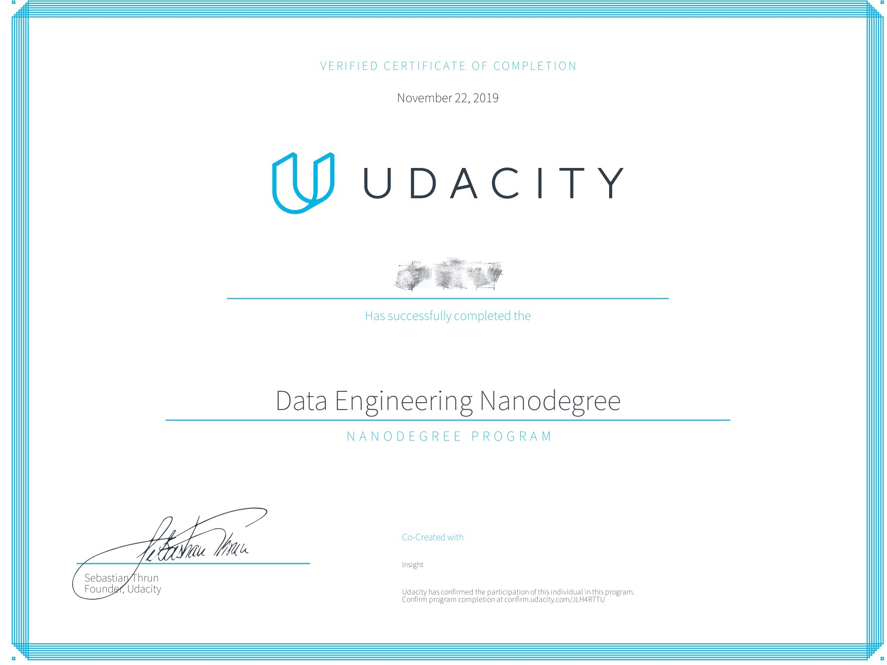

# become-data-engineer
Udacity 数据工程师纳米学位 (DEND)

## 完成的数据工程项目

### 1. 使用Postgres或Apache Cassandra进行数据建模

该实战项目的主题是学习和掌握数据建模，内容包含关系型数据库和非关系型数据库。对于关系型数据库，主要掌握范式设计和反范式的星型模型，雪花模型；对于非关系型数据库，主要了解CAP定理和列式存储。本人负责在项目 开发中将原始数据从csv或json文件读取出来，然后将数据清洗整理入库，形成OLAP数据模型。通过该实战项目学习和掌握数据建模的基本知识。 

### 2. 使用云数据仓库构建ETL管道

该实战项目的主题是学习和理解数据仓库的基础知识，以及掌握亚马逊云服务中S3（Simple Storage Service）和Redshift的使用。本人负责构建ETL数据管道，编写代码从S3中提取原始的云音乐数据，形成staging表存入Redshift，然后转换数据形成事实表和维度表组成的星型数据表，用作分析使用。为了完成该任务，我首先配置和启动Redshift集群，然后设计“事实表+维度表”的数据模型，编写数据仓库建表的相关语句，编写ETL数据管道代码。最后运行代码并分析数据仓库中的数据，并形成文档。通过该实战项目理解了什么是数据仓库，以及如何配合对象存储数据库搭建基本的OLAP系统。

### 3. 使用Spark构建ETL管道

该实战项目的主题是学习Spark的基本知识，如何使用Spark集群来实现大规模数据整理，以及如何使用AWS云服务搭建基本的数据湖。本人负责基于pyspark构建ETL数据管道，编写代码利用Spark从S3中提取云音乐业务数据，将其清洗整理，形成“事实表+维度表”的数据模型，然后将数据写回S3对象存储服务，形成数据湖。为了完成该任务，我首先使用Jupyter Notebook在小数据集上做了试验，调试成功后再迁移到大数据集上。最后编写文档，提供数据字典，并描述详细的使用方法。通过该实战项目理解什么是数据湖，以及如何使用Spark进行大数据处理。

### 4. 使用Apache Airflow构建数据管道

该实战项目的主题是学习自动化数据管道的搭建，包括数据管道的基本概念，任务调度，如何追踪数据血统，如何对数据进行分片，如何保障数据质量以及如何监控数据管道等基础知识，重点掌握Apache Airflow的使用。在实战项目中，本人负责对上面的项目进行自动化改造，利用Airflow编写和实现数据管道，定时将S3中的原始数据读出形成staging表，然后基于该表构建“事实表+维度表”的数据模型，形成数据仓库。为了完成该任务，我首先基于项目提供的基础代码编写了用于构建staging表的`StageToRedshiftOperator`，用于构建事实表的`LoadFactOperator`，用于构建维度表的`LoadDimensionOperator`，用于检查数据质量的`DataQualityOperator`，然后编排计算任务形成DAG，最后调试运行，按照日期进行数据分片驱动airflow清洗和整理每天的数据。通过该实战项目掌握了Airflow的使用，以及自动化数据管道的搭建。

### 5. 毕业项目：Libraries.io数据清洗

最后一个毕业项目需要综合所学的数据工程知识，自行设计项目的数据和范围，搭建一个大数据分析系统。本人负责整个项目的构思，设计和实施。我首先确定了项目的范围：开源软件数据分析，从开源数据集中选取Libraies.io，从中获取了2017年6月15日发布的有关开源软件项目的数据集，将其上传到S3对象存储服务；配置AWS EMR集群，通过Jupyter Notebook结合Spark进行探索性数据分析，对数据进行初步研究形成想法，并在此基础上设计概念数据模型；配置Redshift集群，进行数据管道开发和调试，将原始数据读入数据仓库形成staging表，然后根据staging表清洗和整理数据，构建“事实表+维度表”的物理数据模型，并对数据质量进行检查。最终形成的数据仓库可用于研究和分析开源软件项目，包括它们的STAR数量，贡献者数量，所托管的平台，提交过多少版本以及开发者活跃度等等。可以基于该数仓构建数据可视化面板，形成端到端的数据产品应用和大屏展示。

## 学位证书

